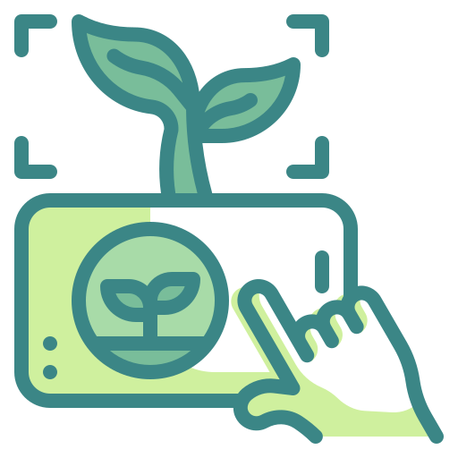

# AgriSense
An IoT-powered smart agriculture system designed to transform traditional farming into a data-driven, efficient, and sustainable practice
<!-- README.md for AgriSense -->

  

<h1 align="center">🌱 AgriSense</h1>

<h3 align="center">
  Revolutionizing Farming with Smart IoT & AI Solutions
</h3>

  
  
  

---

## 🌍 Overview

Modern agriculture faces unprecedented challenges — rising global food demand, unpredictable weather, and increasing resource scarcity. **AgriSense** meets this challenge head-on by merging **IoT, AI, and smart sensors** into a unified solution that empowers farmers to make informed, real-time decisions for more efficient and sustainable farming.

> “From soil to cloud — smart farming made simple.”

---

## 🔍 What is AgriSense?

**AgriSense** is a full-stack smart agriculture system designed to:
- 🛰️ Collect environmental and soil data via IoT sensors  
- ☁️ Transmit information wirelessly to a central dashboard  
- 🧠 Apply AI analytics to guide farmer decisions  
- 📱 Enable 24/7 monitoring via mobile & web apps

---

## 🌾 Key Features

| Feature               | Description |
|----------------------|-------------|
| 🧪 **Soil Monitoring**       | Real-time moisture, temperature, and nutrient sensing |
| 🌦️ **Weather Forecasting**   | Localized AI-driven weather insights |
| 💧 **Smart Irrigation**      | Automated water control based on crop needs |
| 🐛 **Pest & Disease Alerts** | Early warnings using environment + AI models |
| 🌐 **Remote Access**         | Mobile & web dashboards for live farm visibility |

---

## 💡 Why Choose AgriSense?

✅ **Boost Crop Yields** – Optimize every farming decision  
✅ **Save Water & Fertilizer** – Reduce input waste through precision control  
✅ **Eco-Friendly** – Lower environmental footprint with sustainable practices  
✅ **Accessible UX** – User-friendly platform for all tech levels  
✅ **Scalable** – Deploy from small farms to enterprise plantations  

---

## 🚀 Market Potential

> 🌎 Agriculture uses over **70%** of global freshwater and faces workforce shortages.  
**AgriSense** delivers timely, data-backed automation to tackle these pain points.

🎯 Our solutions are ideal for:
- Independent farmers  
- Agricultural cooperatives  
- Smart city programs  
- Government-backed sustainability projects  

---

## 📸 System Snapshot (Coming Soon)

  

---

## 🧱 System Architecture (Planned)

---

## 📁 Project Status

- ✅ Solution deployed to client site
- ✅ Hardware & sensors installed
- ✅ Portal/dashboard live
- 🛠️ Public code not available (shipped)
- 📦 Repo will house brochures, architecture diagrams, and updates

---

## 📂 Folder Layout (Coming Soon)

---

## 📜 License

This solution is proprietary and deployed. Please contact us for demo access or partnership inquiries.

---

## 🤝 Contact Us

| Field | Details |
|-------|---------|
| 💼 Company | BrainCode360 |
| 📧 Email   | info@braincode360.com |
| 🌍 Website | https://braincode360.com |
| 📍 Location | Lahore, Pakistan |

> 📬 Interested in bringing AgriSense to your farms or clients? Let’s talk smart agriculture!

---

  🌱 <b>AgriSense</b> — Data-driven farming for a sustainable future.

